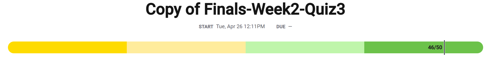

Q2 Answer D is the correct choice. An undecidable problem is one for which no algorithm can be constructed that is always capable of providing a correct yes-or-no answer. Some instances of an undecidable problem may have an algorithmic solution, but there is no algorithmic solution that could solve all instances of the problem.

Q10 Answer A is the correct choice. The status of whether a store is open can be represented using only the values true and false, so a Boolean variable is most appropriate.

Q22 Option B is correct. The fixed number of bits used to represent real numbers (as floating-point numbers) limits the range of floating-point values.

Q26 B is the correct choice. In all four grids, the robot starts along the side of a black region. Step 1 moves the robot just past the end of the black region. Step 2 rotates the robot to the right and moves it forward, placing the robot along the next side of the black region. Step 3 will repeat steps 1 and 2 to move the robot around the other 3 sides to complete a circuit around the black region.